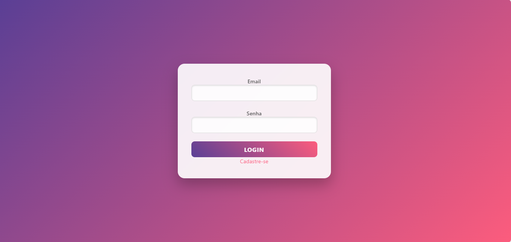
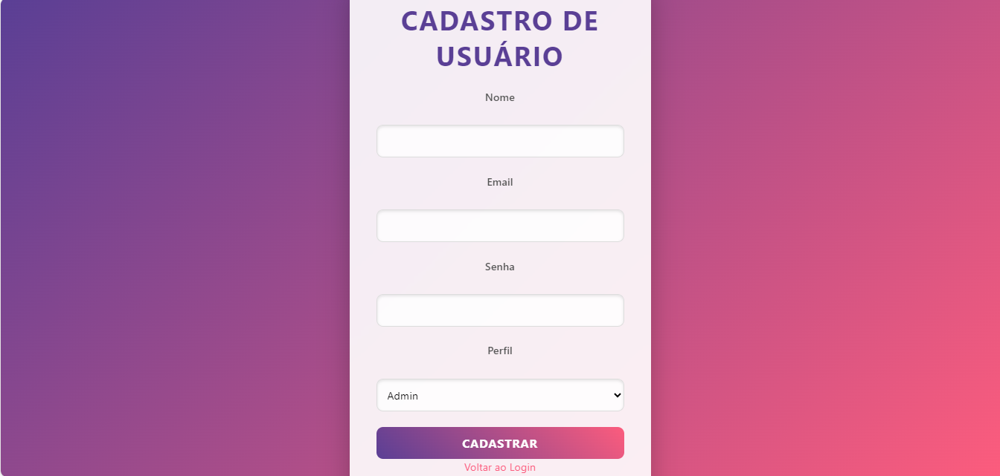

## Projeto ATD I - 3TRI - Aplicação de Cadastro e Login

・┆✦ʚ♡ɞ✦ ┆・・┆✦ʚ♡ɞ✦ ┆・・┆✦ʚ♡ɞ✦ ┆・・┆✦ʚ♡ɞ✦ ┆・・┆✦ʚ♡ɞ✦ ┆・

## ⚜️ Índice ⚜️

- [Descrição](#descrição)
  
- [Introdução](#introdução)

- [Funcionalidades](#funcionalidades)

- [Tecnologias Utilizadas](#tecnologias-utilizadas)

- [Estrutura de Pastas](#estrutura-de-pastas)

- [Tela de Login](#tela-de-login)

- [Tela de Registro](#tela-de-registro)

- [Tela de Edição de Usuário](#tela-de-edição-de-usuário)

- [Função de Exclusão](#função-de-exclusão)

- [Fontes Consultadas](#fontes-consultadas)

- [Autores](#autores)

*.·:·.✧ ✦ ✧.·:·.**.·:·.✧ ✦ ✧.·:·.**.·:·.✧ ✦ ✧.·:·.**.·:·.✧ ✦ ✧.·:·.**.·:·.✧ ✦ ✧.·:·.**.·:·.✧ ✦ ✧.·:·.**.·:·.✧ ✦ ✧.·:·.*

## 📝 Descrição 📝:

Esta aplicação foi desenvolvida para gerenciamento de usuários com funcionalidades de cadastro e login. Ela suporta três níveis de perfis de usuário:

- **Admin**: Acesso total ao sistema, incluindo a administração e gestão de usuários.
- **Gestor**: Acesso com permissões de administração para o gerenciamento de sua equipe.
- **Colaborador**: Acesso restrito, limitado a funções básicas.

A aplicação inclui telas estilizadas de login e registro, conectadas a um back-end desenvolvido em PHP. Com o tempo, o projeto será expandido para oferecer funcionalidades de CRUD completo para gerenciamento de usuários e um sistema de autenticação robusto.

*.·:·.✧ ✦ ✧.·:·.**.·:·.✧ ✦ ✧.·:·.**.·:·.✧ ✦ ✧.·:·.**.·:·.✧ ✦ ✧.·:·.**.·:·.✧ ✦ ✧.·:·.**.·:·.✧ ✦ ✧.·:·.**.·:·.✧ ✦ ✧.·:·.**.·:·.✧ ✦ ✧.·:·.**.·:·.

## Introdução

Este sistema foi criado para simplificar o gerenciamento de usuários em níveis de permissão variados, permitindo controle e personalização detalhada dos acessos de cada perfil. A interface do sistema foi projetada para ser intuitiva e fácil de usar, com foco em eficiência para as operações de cadastro e login.

Este documento oferece um guia para desenvolvedores, incluindo detalhes sobre a estrutura do sistema e as tecnologias utilizadas, para facilitar tanto a manutenção quanto a adição de novas funcionalidades ao projeto.

## 📑 Funcionalidades 📑:

A aplicação oferece as seguintes funcionalidades iniciais:

As funcionalidades principais da aplicação incluem:

- **Cadastro de Usuários**: Permite o registro de novos usuários com escolha de perfil entre Admin, Gestor e Colaborador.

- **Login**: Sistema de autenticação robusto com validação de e-mail e senha.

- **Validação de Formulários**: Regras para garantir que campos obrigatórios (e-mail e senha) sejam preenchidos corretamente.

- **Estilização**: Interface minimalista e acessível com uma paleta de cores azul e dourado para facilitar a navegação.

- **Desenvolvimento Incremental**: O projeto está em constante aprimoramento, com novas funcionalidades sendo adicionadas para segurança e flexibilidade.

  *.·:·.✧ ✦ ✧.·:·.**.·:·.✧ ✦ ✧.·:·.**.·:·.✧ ✦ ✧.·:·.**.·:·.✧ ✦ ✧.·:·.**.·:·.✧ ✦ ✧.·:·.**.·:·.✧ ✦ ✧.·:·.**.·:·.✧ ✦ ✧.·:·.*

## 🔧 Tecnologias Utilizadas 🔧 :

- **PHP**: Backend responsável pela lógica da aplicação e pela conexão com o banco de dados.
 
- **HTML5**: Estrutura de página para semântica e acessibilidade.

- **CSS3**: Estilos aplicados na interface, com foco em usabilidade e responsividade.

- **MySQL**: Banco de dados utilizado para armazenar informações dos usuários.

- **Git/GitHub**: Controle de versão e colaboração em equipe para gerenciar o desenvolvimento.

*.·:·.✧ ✦ ✧.·:·.**.·:·.✧ ✦ ✧.·:·.**.·:·.✧ ✦ ✧.·:·.**.·:·.✧ ✦ ✧.·:·.**.·:·.✧ ✦ ✧.·:·.**.·:·.✧ ✦ ✧.·:·.*

## 📂 Estrutura de Pastas 📂 :

A organização dos arquivos do projeto é dividida da seguinte forma:

- **views**: Contém as páginas front-end para login e registro.

- **controllers**: Lógica de controle que conecta o front-end ao back-end.

- **models**: Interações com o banco de dados MySQL.

- **_css**: Arquivos de estilo para a interface da aplicação.

- **index.php**: Arquivo principal que inicializa o sistema.

*.·:·.✧ ✦ ✧.·:·.**.·:·.✧ ✦ ✧.·:·.**.·:·.✧ ✦ ✧.·:·.**.·:·.✧ ✦ ✧.·:·.**.·:·.✧ ✦ ✧.·:·.**.·:·.✧ ✦ ✧.·:·.**.·:·.✧ ✦ ✧.·:·.*

## 💻 Tela de Login 💻 :

A tela de login foi implementada para ser simples e funcional. Está localizada em "views/login.php" e inclui os seguintes campos:

- Email: Campo de entrada para o e-mail do usuário.
- Senha: Campo de entrada para a senha do usuário.

A validação ocorre tanto no front-end quanto no back-end, garantindo que apenas usuários registrados possam acessar o sistema.

*.·:·.✧ ✦ ✧.·:·.**.·:·.✧ ✦ ✧.·:·.**.·:·.✧ ✦ ✧.·:·.**.·:·.✧ ✦ ✧.·:·.**.·:·.✧ ✦ ✧.·:·.**.·:·.✧ ✦ ✧.·:·.**.·:·.✧ ✦ ✧.·:·.**.·:·.✧ ✦ ✧.·:·.*

## 🖨 Tela de Registro 🖨 :

A tela de registro, localizada em views/register.php, permite que novos usuários criem contas, selecionando um dos três perfis disponíveis:

- Admin
- Gestor
- Colaborador

O sistema garante a validação dos dados inseridos e a criação segura do novo usuário no banco de dados.

##  🖨 Tela de Edição de Usuário  🖨 :

Localizada em `views/edit_user.php`, esta tela permite que os dados do usuário sejam modificados. O acesso à edição é permitido apenas para Admins e Gestores.

##  🖨 Função de Exclusão  🖨 :

A aplicação inclui a funcionalidade de exclusão de usuários, controlada por níveis de permissão:

- **Admin**: Pode excluir qualquer usuário. Uma confirmação é solicitada ao clicar no botão "Excluir" para prevenir exclusões acidentais.
- **Gestor/Colaborador**: Não possuem permissão para excluir outros usuários.

Este controle de acesso assegura que apenas perfis com as permissões apropriadas possam realizar ações críticas, reforçando a segurança do sistema.

*.·:·.✧ ✦ ✧.·:·.**.·:·.✧ ✦ ✧.·:·.**.·:·.✧ ✦ ✧.·:·.**.·:·.✧ ✦ ✧.·:·.**.·:·.✧ ✦ ✧.·:·.**.·:·.✧ ✦ ✧.·:·.**.·:·.✧ ✦ ✧.·:·.**.·:·.✧ ✦ ✧.·:·.*

## 🔎 Fontes Consultadas 🔍 :

- Documentação oficial do [PHP](https://www.php.net/docs.php).
- Guia de boas práticas em [HTML5 e CSS3](https://developer.mozilla.org/pt-BR/docs/Web/HTML).
- Exemplos e dicas de projetos similares no [Stack Overflow](https://stackoverflow.com).

*.·:·.✧ ✦ ✧.·:·.**.·:·.✧ ✦ ✧.·:·.**.·:·.✧ ✦ ✧.·:·.**.·:·.✧ ✦ ✧.·:·.**.·:·.✧ ✦ ✧.·:·.**.·:·.✧ ✦ ✧.·:·.**.·:·.✧ ✦ ✧.·:·.*

## 👑 Autores 👑
Nicolly da Silva D'avila - 3ºA

